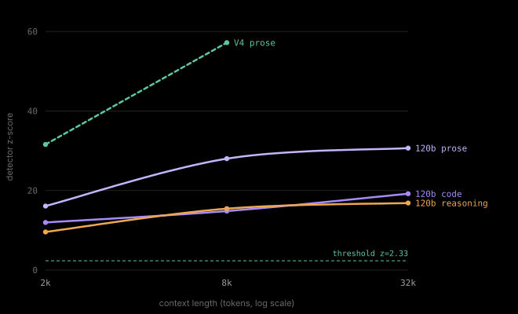
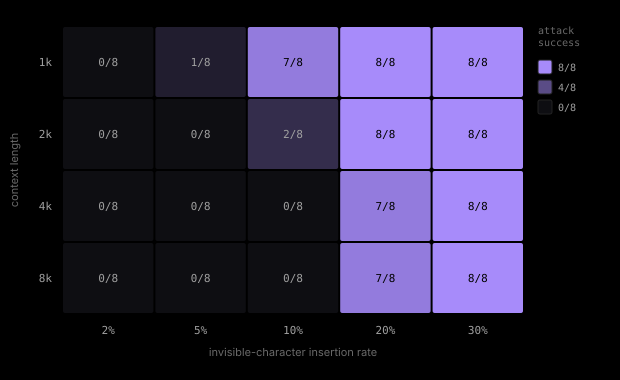

# claude-awm: can you scrub a SynthID text watermark by editing the text?


**Yes, but only one family of attack works, and it isn't the one everyone assumes.**

Unicode **variation selectors** (category Mn, U+FE00 to U+FE0F and U+E0100 to U+E01EF) drive the detector below threshold and *stay* there. Every other invisible-character attack I tried gets fully reverted by one line of input normalization. Variation selectors don't, because they're meaningful codepoints (emoji presentation, CJK variants) that NFKC will not and should not fold away.

Replicated across models and domains:

| model | domain | baseline z | after `vs16_30` | edit rate |
|---|---|---|---|---|
| gpt-oss-20b | prose | 45.03 | **0.72** | 57% |
| gpt-oss-20b | code | 37.24 | **0.68** | 58% |
| Qwen3.8-27B | prose | 35.50 | **-0.67** | 57% |

Threshold is z = 2.33. All three land under it after the attack, and stay under after normalization (0.09, 0.45, -0.78 respectively). Text renders identically to a human reader.

The second real finding needs no attack at all: **low-entropy text is barely watermarked to begin with.** With thinking disabled, Qwen3.8-27B's pure code output scores z = 4.31 unattacked, close to the 2.33 threshold with nothing done to it. Turn thinking back on and the same model, same domain, same length reaches z = 25.53, because the reasoning preamble is ordinary prose and carries the mark normally.

## models tested

Everything in this repo was measured on these, nothing else:

| model | params | where | what was run |
|---|---|---|---|
| Qwen3.5-0.8B | 0.8B | Mac (MPS) | full attack ladder, 1k-8k |
| Qwen3.5-4B | 4B | Mac / 4090 | full attack ladder + the entropy experiment + stego raw/normalized |
| DeepSeek-R1-Distill-Qwen-14B | 14B | Mac (MLX, 4-bit) | watermark + detect, reasoning traces |
| gpt-oss-20b | 20B | 3090 / 4090 / RunPod | full attack ladder to 32k, prose + code, variation selectors, insertion-rate scaling law to 131k |
| Qwen3.8-27B | 27B | RunPod H100 / Modal H100 | prose + code, variation selectors, thinking-mode contrast |
| gpt-oss-120b | 120B | Modal H100 (MXFP4) / RunPod H100 | prose + code + reasoning at 2k / 8k / 32k, partial insertion-rate scaling to 65k |
| DeepSeek-V4-Flash | 284B MoE | RunPod 2x H200 (FP8) | prose + code at 2k / 8k |

Not every experiment ran on every model, and the tables below say which ran
where. Larger models were added as the interesting questions narrowed, so the
attack ladder is broad on the small ones and the length and domain work is
concentrated on the large ones.

## what this is

Anthropic (and Google DeepMind before them, the [SynthID-Text](https://www.nature.com/articles/s41586-024-08025-4) paper) watermark generated text by biasing token sampling with a keyed tournament. The signal lives in *which tokens got picked*, not in any hidden character. I wanted to know how fragile that is to a motivated person with a find-and-replace, so I built the generator plus an untrained mean-g detector and threw attacks at it.

Detector threshold is z = 2.33 (1% false positive rate). Above that = watermark detected. I generated watermarked text, attacked it, re-tokenized, and scored. Every results table carries a `roundtrip` control (unattacked watermarked text) so you can see the detector is actually working in that row. Twice this study a bug made every z collapse to zero, and the control is the only thing that caught it.

## scope of the attack: what actually works

The attack surface splits cleanly by **Unicode category**, which turned out to be the whole story.

**Works (category Mn, nonspacing marks):**

| attack | what it does | edit rate | survives normalization? |
|---|---|---|---|
| `vs16_30` | variation selector after ~30% of chars | 57% | **yes** |
| `vs16` | variation selector after ~10% of chars | 23% | **yes** (z 3.46) |
| `vs_supp` | supplementary-plane selectors (U+E0100+) | 24% | **yes** (z 3.40) |
| `homoglyph` | Cyrillic а for Latin a (category Ll) | 9% | **yes**, but weak effect |

**Doesn't work (category Cf, format chars):**

| attack | raw z | normalized z | verdict |
|---|---|---|---|
| `zwsp_30` | -0.09 | **35.68** | fully reverted |
| `combo` | 0.92 | **35.68** | fully reverted |
| `bidi` | 24.37 | **35.68** | fully reverted |
| `nbsp` | 41.04 | 46.51 | barely moves it |

Cf characters are pure formatting with no semantic content, so a normalizer can strip them wholesale and lose nothing. Mn variation selectors carry real meaning in emoji and CJK text, so blanket-stripping them would corrupt legitimate documents. That asymmetry is why one family is defensible and the other isn't.

**The practical scope:** this needs roughly 20% or more of characters touched to push a strong baseline under threshold, but the inserted characters are invisible, so the text reads normally at any edit rate. It is verified visually identical, see [src/fidelity_check.py](src/fidelity_check.py). Four families insert only characters that render nothing; homoglyphs are the honest exception (font-dependent, not guaranteed invisible).

## what doesn't work: the obvious stuff

My starting fear was the boring one: that em-dashes and "and" to "&" and stripping markdown would just work, and the watermark would turn out to be security theater. A lot of people online assume exactly that.

It doesn't work. The whole surface-edit ladder on gpt-oss-20b, out to 32k tokens:

| attack | edit rate | z @ 1k | z @ 32k |
|---|---|---|---|
| roundtrip (control) | 0% | 25.7 | 104.3 |
| em-dash to hyphen | ~0% | 26.4 | 113.7 |
| strip **all** markdown | 13.6% | 27.2 | 103.3 |
| AmE to BrE + abbreviations | 1.3% | ~28 | ~100 |
| delete 40% of every word | 38% | 4.9 | 25.4 |

Across the three models this ladder ran on (0.8B, 4B, 20B = 294 cells), exactly **one** cell crossed threshold: deleting 39% of every word at the shortest length on the 4B. That's not an attack, that's shredding the document.

**Total measured cells across the whole study: 440** (294 from the attack ladder above, plus 146 from the scaling-law sweep below extending prose to 131072 tokens).

Two things surprised me:

- **Edit *count* doesn't predict damage, edit *geometry* does.** Stripping all markdown (13.6% of tokens) did nothing; it even scored slightly *above* baseline. Injecting stray spaces at 1.6% did 25x more damage per edit. Markdown markers cluster, so their corruption windows overlap and the long prose runs between them keep replaying the watermark seed intact. Scattered edits that desync the tokenizer hit fresh windows every time.
- **Length helps the detector, not the attacker.** z grows like sqrt(tokens). "Fool it over a long context" is backwards, 32k is the hardest case to attack, not the easiest.

Full mechanism and per-attack tables in [docs/FINDINGS.md](docs/FINDINGS.md).

### the detector wins by waiting



Watermark confidence grows with context while per-token signal stays flat, so a longer document is *harder* to attack, not easier. Prose carries the strongest mark at every length; DeepSeek-V4-Flash (dashed) reproduces the same climb on a 284B MoE.



And the attack has to keep up. Each cell is how many of 8 random insertion seeds beat the detector. 10% insertion clears 1k tokens but fails completely by 4k; only 30% held everywhere tested. **The required insertion rate rises with context length**, which is why the attack is not context-agnostic.

A dedicated follow-up sweep pins this down precisely: on gpt-oss-20b, from 1024 tokens all the way to 131072 (the model's max context), the required insertion rate follows **p\*(L) ≈ 2.37·log2(L) − 14.6** -- climbing from 9.3% at 1k tokens to 25.0% at 131k. A fixed 30% rate holds up across the *entire* measured range with room to spare; extrapolating the fit, it wouldn't be expected to fail until millions of tokens. A parallel partial run on gpt-oss-120b shows a consistently weaker watermark (~0.4x the z-score of 20b at matched length) and a correspondingly lower required rate (~20-23% at 131k, extrapolated from 3 of 4 lengths). Full tables, fits, and caveats in [docs/FINDINGS.md § 14](docs/FINDINGS.md).

[Interactive versions →](https://aloshdenny.com/claude-awm/charts.html)

**[Try the interactive version →](https://aloshdenny.com/claude-awm/)** Real study samples with a before/after reveal toggle, plus a playground to run the attack transform on your own text. It won't tell you if arbitrary pasted text is really watermarked (that needs a key we don't have), and it says so; see [site/](site/) for the generator script.

## the finding that needs no attack

The watermark rides on the model's per-token uncertainty. Where the model is confident about the next token, the tournament has no room to bias it, so no signal goes in. That means **the mark is weak on low-entropy text, and code is low-entropy.**

Qwen3.5-4B, prose vs code, 512-token samples, no attack at all:

| domain | entropy | z |
|---|---|---|
| prose | 1.19 bits/tok | 11.1 |
| code | 0.55 bits/tok | 5.0 |

z ratio 0.45x, entropy ratio 0.46x, they move together, which is the mechanism showing through. **3 of 8 code samples fell to or below the detection threshold on their own.** The tightest one (a bare algorithm, 0.2 bits/token) scored 1.7, a miss.

It gets more extreme at scale. Baseline z with no attack whatsoever:

| model | prose | code | ratio |
|---|---|---|---|
| gpt-oss-20b | 45.03 | 37.24 | 0.83 |
| Qwen3.8-27B | 35.50 | **4.31** | **0.12** |

Qwen3.8-27B's code output is so templated that the clean, unattacked watermark sits at z = 4.31, barely above the 2.33 threshold. No adversary required.

It says: a single confidence threshold across domains is unsafe, and short code snippets are close to unwatermarkable. Generalizes to JSON, config, structured extraction, boilerplate.

## defensive takeaway

If you ship one of these detectors, normalizing input gets you most of the way, but not all of it:

1. Strip Cf-category characters. Kills zero-width, bidi, and the combos. This is the big win.
2. NFKC fold. Handles nbsp and compatibility forms.
3. **Strip the variation selector ranges explicitly.** NFKC won't do it for you, and this is the gap that's currently open.
4. Keep a Unicode confusables map (UTS-39) for homoglyphs. NFKC won't do that either.

Steps 3 and 4 are the ones a naive normalizer misses.

## what's wrong with this / what I didn't get to

Being honest about the gaps.

- **The 27B code numbers are uninformative as an attack result.** The unattacked baseline there is z = 4.31, so you can't demonstrate an attack beating a detector that's already nearly blind. I kept those rows but labelled them; the meaningful signal is the baseline, not the attack deltas.
- **Whether the 27B code result is entropy or model style is unresolved.** It needs a per-token entropy measurement like the 4B got, which I didn't run for that model.
- **Three community quantized checkpoints of Qwen3.8-27B failed to load** (FP8 wanting a torch dtype we don't have, two AWQ/compressed-tensors repacks with packing mismatches). Ran it at bf16 on an H100 instead. If you're reproducing, skip the repacks.
- **The detector is the untrained mean-g scorer, not the trained Bayesian one** from the paper. The Bayesian detector would likely be *more* sensitive, so these z values are a floor, but I didn't measure it.
- **My homoglyph fidelity claim is "typical reader," not proven.** Cyrillic а is category Ll, so its invisibility is a font property, not a Unicode guarantee.
- **n is small**, 2 documents per cell for the ladders, 8 samples per domain for entropy. Enough for the effect sizes here (they're large), not enough for tight per-attack error bars.
- I don't provide a tuned evasion recipe and that's deliberate. Every attack here is reported alongside the normalization result that does or doesn't defeat it. The point was to measure where the frontier is, not to package a bypass.

## layout

```
src/synthid_robustness.py   generator + attack ladder + mean-g detector + normalizer
src/code_vs_prose.py        the entropy experiment (with per-token entropy tap)
src/fidelity_check.py       proves the stego attacks are visually identical
src/synthid_mlx.py          watermarking bridge for Apple Silicon (MLX), validated vs HF
src/prompts_code.py         prose / code / mixed prompt sets
src/build_report_data.py    assembles results/ into the tables in FINDINGS.md
results/                    the JSON this is all computed from
docs/FINDINGS.md            every table, the defense hierarchy, the bugs I caught
site/                       the interactive page, source for aloshdenny.com/claude-awm
connector/                  a local MCP server for Claude: detection only, see below
```

## the Claude connector

[connector/](connector/) is a local MCP server exposing one real tool to Claude: paste text, get back a verdict, a z-score, and a per-token g-value heatmap, scored with the exact detection math from `synthid_robustness.py`. It is detection-only on purpose. There is no tool that hands back a modified version of your text, and it can't tell you whether text really came from Claude or any other production system, since that needs a key only the issuing company has. Setup in [connector/README.md](connector/README.md).

## running it

```bash
python -m venv .venv && . .venv/bin/activate
pip install -r requirements.txt
```

```bash
# generate watermarked docs + run the full attack ladder on a model
MODEL=Qwen/Qwen3.5-4B LENGTHS=1024,2048,4096,8192 N_DOCS=2 \
  DOCS=docs_4b.json OUT=res_4b.json python src/synthid_robustness.py

# the entropy experiment (code vs prose)
python src/code_vs_prose.py --model Qwen/Qwen3.5-4B --out res_cvp_4b.json

# the variation-selector / stego attacks, scored raw AND post-normalization
ATTACK_SET=desync DEFENSE=1 PROMPT_SET=prose MODEL=Qwen/Qwen3.5-4B \
  DOCS=docs_4b.json OUT=res_defense.json python src/synthid_robustness.py
```

`PROMPT_SET` takes `prose`, `code`, or `mixed`. `FAST_WM=1` uses a numpy watermark bridge (faster on small-vocab models with a strong CPU), `FAST_WM=0` uses HF's GPU processor (much faster on big-vocab models; on an H100 this was the difference between 0% and 46% GPU utilisation).

Watermarking needs the full next-token distribution, so it runs through `transformers` (CUDA native MXFP4, or MPS/CPU). Ollama and llama.cpp can't do it, they don't expose logits mid-generation. On Apple Silicon, `src/synthid_mlx.py` bridges MLX generation into the watermark math; it's validated bit-identical to the HF reference.
